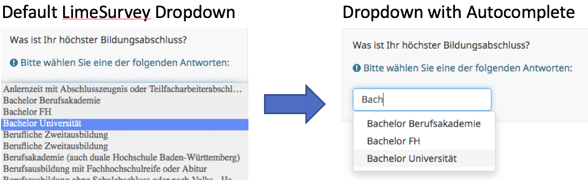

# LimeSurvey List (Dropdown) Autocomplete
This code snippet converts a LimeSurvey List-Object (Dropdown) into a dropdown with autocomplete functionality.



## Requirements
1. LimeSurvey instance must support **JavaScript** in the question editing menu.
2. Survey must include [JQuery UI](https://code.jquery.com/ui/)

## Usage
1. Edit a question where question type is "List (dropdown)".
2. In the editor window click "Source".
3. Add JavaScript code snippet from [autocomplete.js](autocomplete.js) to the question text:
   1. Remote:
        ```HTML
        <script src="https://raw.githubusercontent.com/jatoko/master/autocomplete.js"></script>
        ```
    2. Inline:
        ```HTML
        <script>
                Code Here
        </script>
        ```
