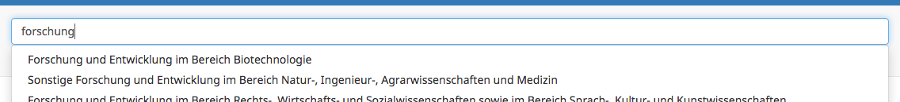

# Surveycodings API integration in LimeSurvey
This code snippet allows querying the [API of SurveyCodings](https://api.surveycodings.org) for elicitation of education, occupation and industry.




## SurveyCodings
SurveyCodings is the result of the EU funded [seriss project](https://www.surveycodings.org/) that built a database of items to elicit demographic data. Items are available in multiple languages and allow cross-national comparisons of results.

## Requirements
1. LimeSurvey instance must support **JavaScript** in the question editing menu.
2. Survey must include [JQuery UI](https://code.jquery.com/ui/)

## Usage
1. Edit a question where question type is "Text".
2. In the editor window click "Source".
3. Add JavaScript code snippet from [autocomplete.js](autocomplete.js) to the question text:
   ```HTML
        <script>
                Code Here
        </script>
    ```