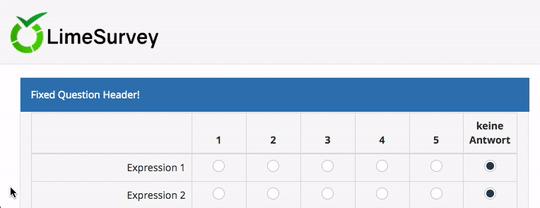

# LimeSurvey On Scroll Fixed Question Header
This code snippet fixes the question header's position when scrolling long answer sections.

## Requirements
1. LimeSurvey instance must support **JavaScript** in the question editing menu.

## Usage
1. Edit a question where question type is "Array".
2. In the editor window click "Source".
3. Insert JavaScript code snippet from [on_scroll_fixed.js](on_scroll_fixed.js).
